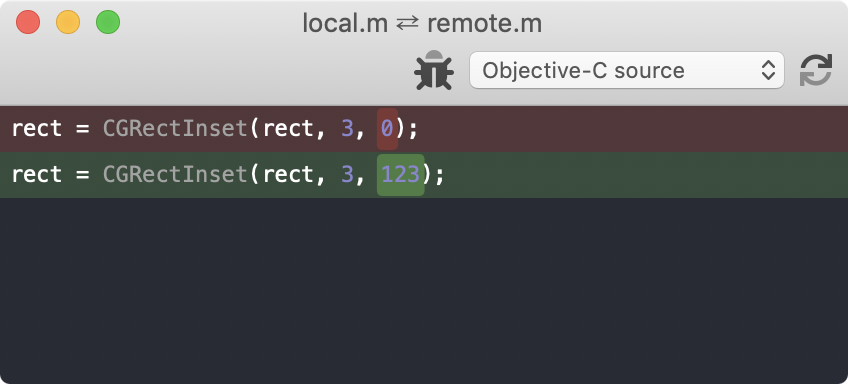

#  Prism.app

Prism.app is a [file comparison](https://en.wikipedia.org/wiki/File_comparison) tool for [macOS](https://en.wikipedia.org/wiki/MacOS) which uses the most excellent [Prism syntax highlighter](https://prismjs.com) for tokenization instead of the normal line based splitting.


<p align="center">
  
</p>

### Command line tool

Prism.app also contains a cli tool which may be installed to make life in the terminal a bit easier.

```shell
prism -local local.txt -remote remote.txt
```

### Git config for UI

1. In the app click on Buildhead ▶ Install Command Line Tools…
2. In `.gitconfig`, add the following statement:

    ```ini
    [difftool "Prism"]
      cmd = /usr/local/bin/prism -local \"$LOCAL\" -remote \"$REMOTE\" -gui YES
      path = 
    ```

### App Icon

The [Prism app icon](https://www.flaticon.com/free-icon/prism_519423) was made by [Freepik](https://www.flaticon.com/authors/freepik) from [www.flaticon.com](https://www.flaticon.com/).

### Icons

Other icons are from [Font Awesome](https://fontawesome.com)'s free collection (with slight modifications to look good on the toolbar).

